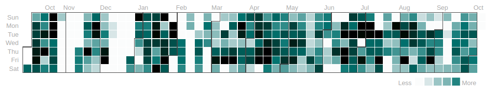

# Workrave Activity Heatmap

Creates a calendar heatmap visualization of Workrave's stats showing the level of activity per day.

The output calendar is similar to Github's one.




## How to use

Use ```workrave2csv``` script to convert your ```~/.workrave/historystats``` into a csv file. 
Then load that csv in ```index.html```.

## ToDo

* Transform seconds of activity into HH:MM:SS
* Change label 'contributions'

## Credits

Used libraries:

* calendar-heatmap: https://github.com/paradite/calendar-heatmap
* jquery-csv: https://github.com/evanplaice/jquery-csv/
* jquery

## License

The code is under GPLv3
